### 1.  List列表

- index( )  返回列表中指定元素的的索引，如果有相同元素则返回第一个元素的索引

​              index( 'hello' )

​              index('hello', 1,4)  在[1,4 ) 范围内查找

- 列表的切片：  [ start : stop : step ]（开始   结束  步长）

​								 [start   stop)

- 判断元素是否存在其中 

  ​     ' p ' in ' python ' #  True

​              元素  in  列表名   /   元素  not  in  列表名

- 添加元素： 

  ​         append( )  : 在列表末尾追加加一个新元素（未创建新列表）

  ​         extend( )： 在末尾治添加多个元素，可添加一个列表

​				insert( ) : 在指定位置处添加一个元素 .   insert(1, 9)

- 删除元素

  

-  修改

  ​       list[索引] = ...

  ​       list[1,3] = [1,2,3]  表示将索引1，2位置的元素更换为1，2，3

- 排序 

  ​        sort(  ) 默认升序，也可以指定reverse=True 进行降序排列


### 2. 字典

- 获取元素：


-    增删改

  

- 字典生成式  (zip( ) 以最短的列表进行匹配生成字典，)

  ```python
  list1 = ['a','b','c','d']
  list2 = [1,2,3,4]
  d = {k:v for k, v in zip(list1,list2)}
  ```

### 3. 元组

- 元组的几种创建方式

  

**为什么要将元组设计为不可变序列：**


元组保证了元组内部元素id地址不能被更改，但是元组元素的内部元素是可以增加的（如列表）


### 4. 集合

- 集合的创建方式

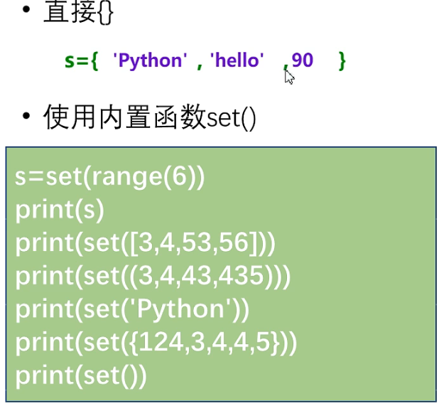

- 特性

   集合不允许重复的元素，自动去重  

- 集合中的操作

  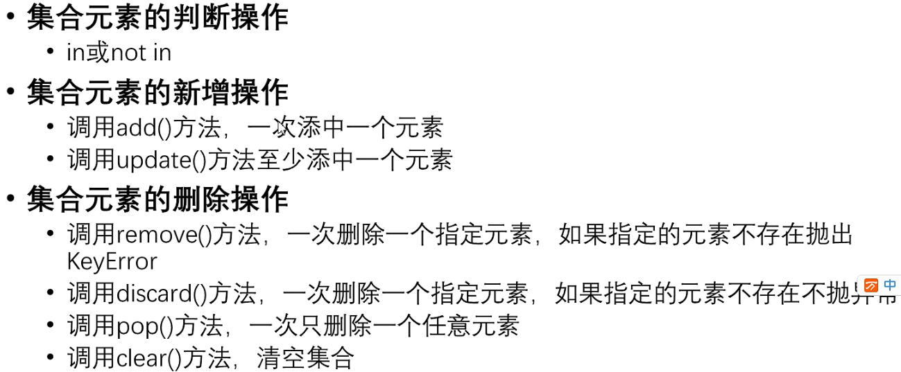

### 5. 字符串操作

**字符串的驻留机制：**

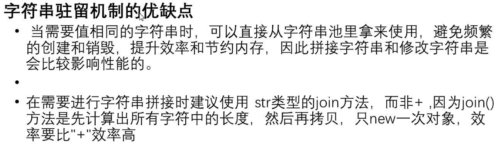

- 字符串的查询操作

  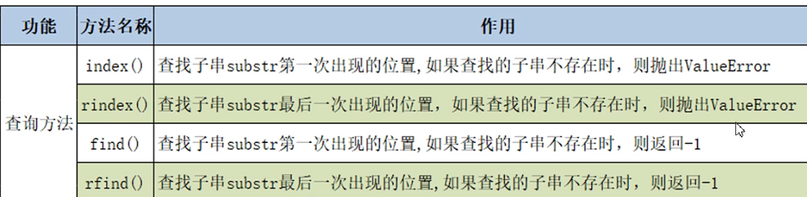

- 字符串的大小写转换

  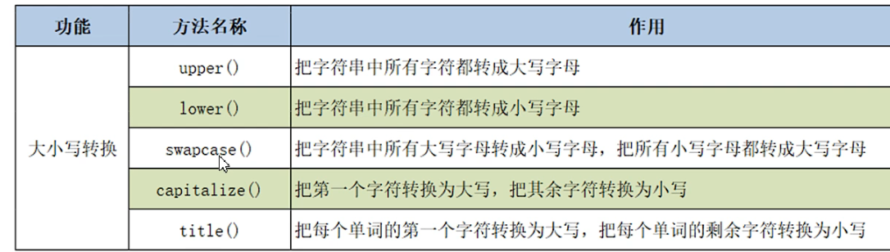

- 字符串的拆分

  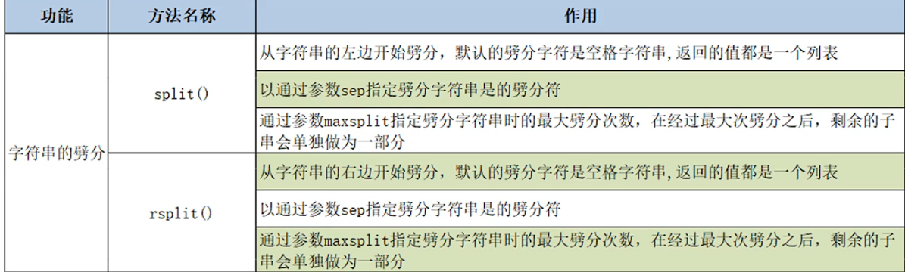

- 字符串的替换与合并

  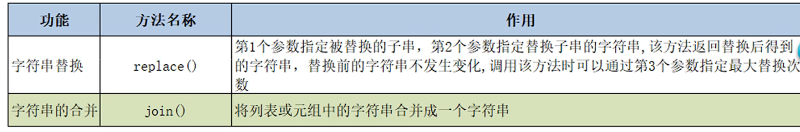

- 判断字符串的方法

  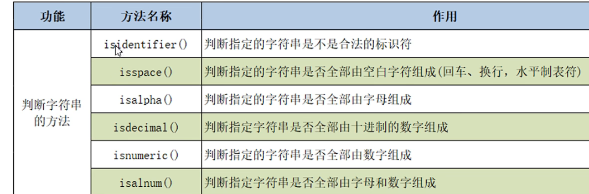

- ord()与chr()

  ​        获取的是字符的原始值

  ```python
  print(chr(97),chr(98))   #  a b
  print(ord('a'),ord('b')) #  97 98
  ```

- 字符串切片操作

  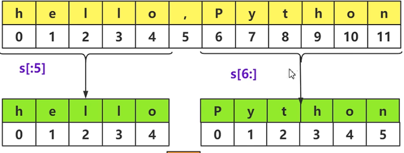

  str[1:5:2]  表示从索引1截到4，步长为2

- 字符串的格式化

  - %  作为占位符   

  - {} 作为占位符

  - f-string格式化（python3.6之后）

       name = '豆'

       age = 22

       print(f'我姓{name},今年{age}')

    

    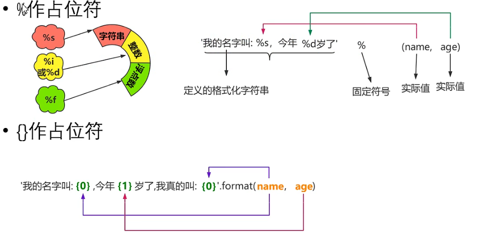

- 字符串的对齐操作

  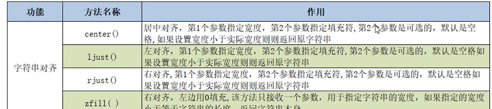


### 6. 可变参数 *args   **kwargs

-  ***args**表示可接受任意个（包含0个）位置参数，当函数调用时，所有未使用（未匹配）的位置参数会在函数内自动组装进一个tuple对象中，此tuple对象会赋值给局部变量args


- ** **kwargs**表示可接受任意个（包含0个）关键字参数，当函数调用时，所有未使用（未匹配）的关键字参数会在函数内组装进一个dict对象中，此dict对象会赋值给局部变量kwargs

  

### 7. 异常处理机制

- **try ....catch.....else**   :  try中抓取到异常，则执行except，否则执行else

  **Traceback模块：** 有**print_exc( )与format_exc( )** 两种方法 ，可写在except中，用于显示异常的代码行详细信息

  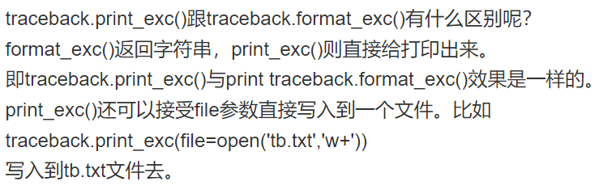

### 8. 文件的读写

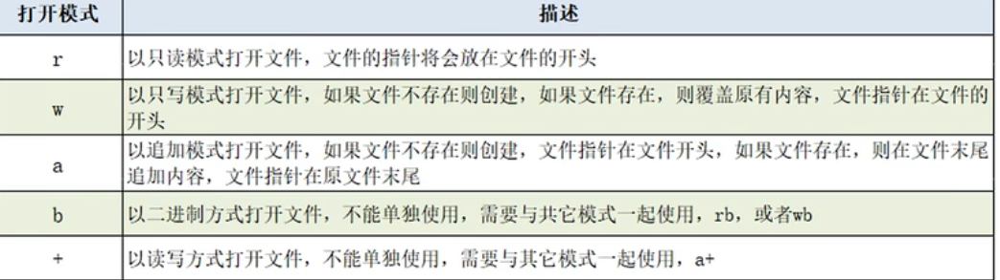

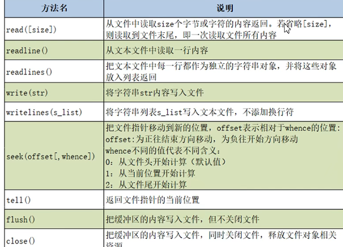

**with**

  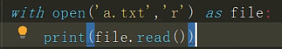

with语句可以自动管理上下文资源，不论什么原因跳出with语句都会自动关闭文件，达到释放资源的目的，不需要手动close关闭。


### 9. OS、OS.path、Path模块

- **OS操作目录**

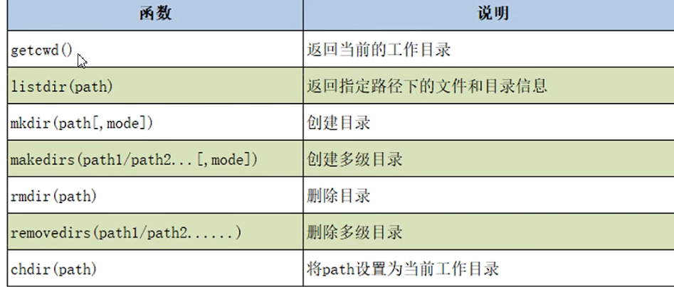

- **OS.path操作目录**

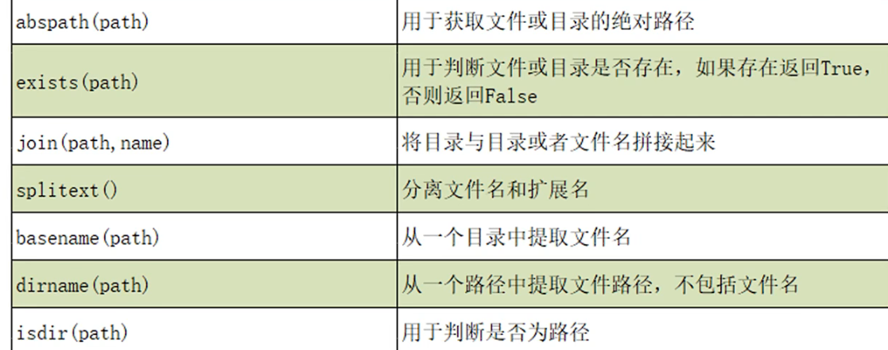

​                                 **isfile( filepath )**                                                                   用于判断是否是文件

- **Path** 

Python3的系统标准库pathlib模块的 [Path]([(37条消息) 路径处理库pathlib使用详解_itanders的博客-CSDN博客_pathlib](https://blog.csdn.net/itanders/article/details/88754606?ops_request_misc=&request_id=&biz_id=102&utm_term=pathlib import Path   __file__&utm_medium=distribute.pc_search_result.none-task-blog-2~all~sobaiduweb~default-3-88754606.142^v26^control,157^v15^new_3&spm=1018.2226.3001.4187)) 对路径的操作相对OS. path更简单

### 10. 字符串前加u,r,b,f

- u :  表示后面字符串以 Unicode 格式 进行编码，一般用在中文字符串前面
  **例：** u"我是含有中文字符组成的字符串"

- r : 去掉反斜杠的转移机制。
  **例：** r"\n\n\n\n”　　# 表示一个普通生字符串 \n\n\n\n，而不表示换行了。

- b :   b" "前缀表示：后面字符串是bytes 类型。
  **例:** response = b’<h1>Hello World!</h1>’ # b’ ’ 表示这是一个 bytes 对象

- f:  以 f开头表示在字符串内支持大括号内的python 表达式

​		**例**：print(f’{name} done in {time.time() - t:.2f} s’)