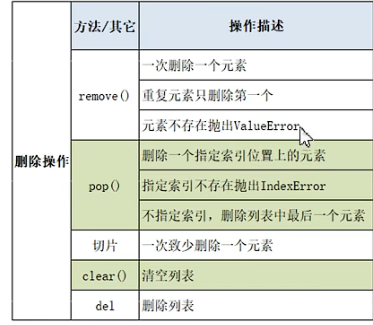
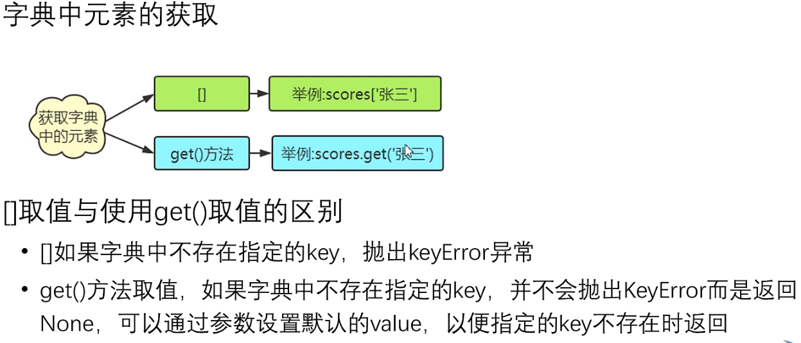
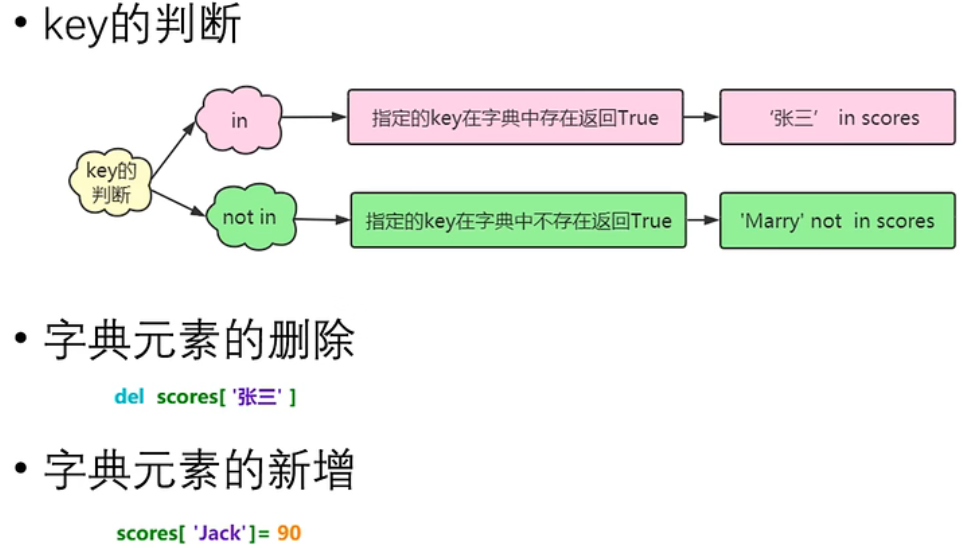
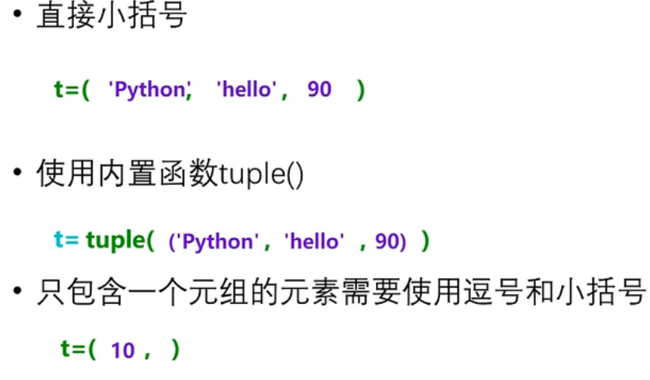
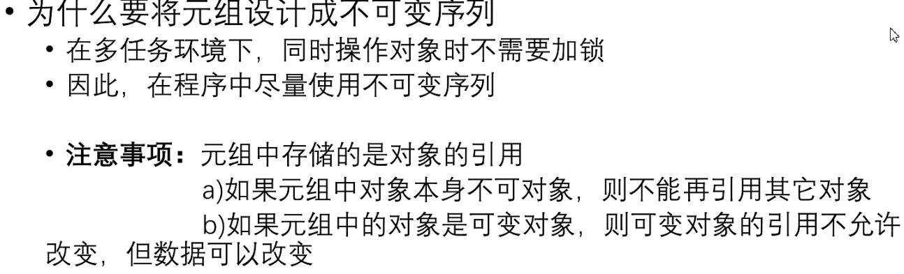
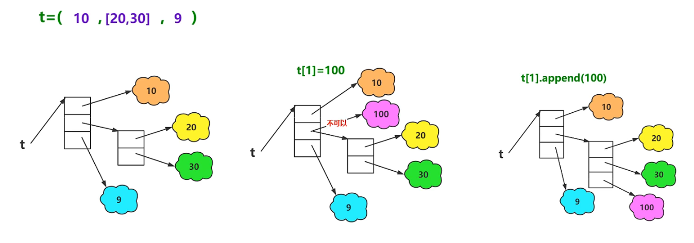

### 1.  List列表

- index( )  返回列表中指定元素的的索引，如果有相同元素则返回第一个元素的索引

​              index( 'hello' )

​              index('hello', 1,4)  在[1,4 ) 范围内查找

- 列表的切片：  [ start : stop : step ]（开始   结束  步长）

​								 [start   stop)

- 判断元素是否存在其中 

  ​     ' p ' in ' python ' #  True

​              元素  in  列表名   /   元素  not  in  列表名

- 添加元素： 

  ​         append( )  : 在列表末尾追加加一个新元素（未创建新列表）

  ​         extend( )： 在末尾治添加多个元素，可添加一个列表

​				insert( ) : 在指定位置处添加一个元素 .   insert(1, 9)

- 删除元素

  

-  修改

  ​       list[索引] = ...

  ​       list[1,3] = [1,2,3]  表示将索引1，2位置的元素更换为1，2，3

- 排序 

  ​        sort(  ) 默认升序，也可以指定reverse=True 进行降序排列


### 字典

- 获取元素：



-    增删改

  

- 字典生成式  (zip( ) 以最短的列表进行匹配生成字典，)

  ```python
  list1 = ['a','b','c','d']
  list2 = [1,2,3,4]
  d = {k:v for k, v in zip(list1,list2)}
  ```

### 元组

- 元组的几种创建方式

  

**为什么要将元组设计为不可变序列：**



元组保证了内部元素id地址不能被更改，但是对于列表元素的内部元素匙是可以增加的



